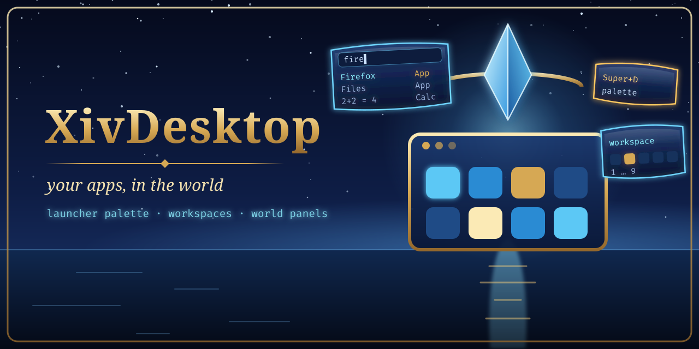
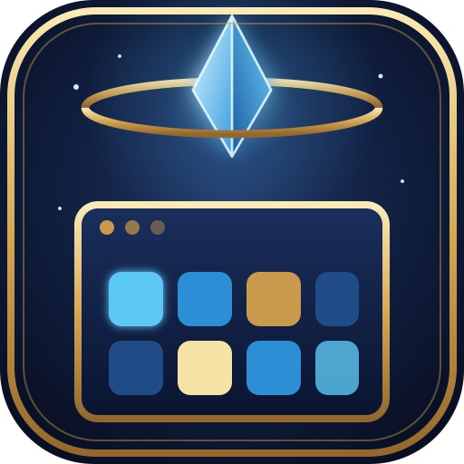

# XivDesktop

<p align="center">
  <picture>
    <source media="(prefers-color-scheme: dark)" srcset="images/readme/hero-dark.png">
    <source media="(prefers-color-scheme: light)" srcset="images/readme/hero-light.png">
    
  </picture>
</p>



**Your Linux applications, organized inside FINAL FANTASY XIV.**

XivDesktop is a Dalamud launcher for the Linux host's apps: search, favourites,
recents, a keyboard-first palette, window/workspace controls and optional Umbra
widgets. **It does not render or stream application windows.** A compatible
[Ghostty for Dalamud](https://github.com/Spaceghost/ghostty-dalamud) build and
its host agent supply the compositor and world panels.

> **Status: experimental, not verified in game.** The project targets Dalamud
> API 15 / .NET 10. Host tests exercise catalog/search, calculator, key chords,
> workspaces and IPC payloads; the scanner has been exercised on a Linux host.
> These do not verify Wine input, a running Ghostty backend, visible windows,
> NPC/session interfaces or either Umbra widget. In-game descriptions below
> are implemented intent and checks to perform, not observed results.

[Requirements](#requirements) · [Install](#install-from-the-plugin-repository) ·
[First success](#first-success) · [Commands](#in-game) ·
[Troubleshooting](#troubleshooting) · [Full guide](GUIDE.md)

## What you get

| Surface | Purpose and boundary |
| --- | --- |
| Launcher palette | Search apps and panels, run actions, or use a bounded calculator. Opens with `/desktop`; Super+D is a configurable shortcut. |
| App grid | Icons, favourites and recent apps. A populated catalog does not prove that the agent can launch a window. |
| Workspaces and panel controls | Nine workspaces, focus, close and placement through Ghostty IPC. Advanced operations require the corresponding methods in the installed Ghostty build. |
| Umbra Apps / Windows widgets | Optional launcher and taskbar clients of XivDesktop's IPC; neither replaces the required Ghostty backend. |
| NPC / Claude interfaces | Experimental local-model dialogue and Claude Code sessions. They add their own backend, permission and runtime requirements; neither is needed for the app catalog. |

## How it fits together

```text
FINAL FANTASY XIV under Wine
  /desktop / palette / optional Umbra widgets
        |
  XivDesktop plugin
        +-- catalog: host agent's app list; filesystem scan as fallback
        +-- search, favourites, recents, workspace bookkeeping
        `-- GhosttyDalamud.v1.Call / fallback Post
                  |
          compatible Ghostty plugin --> ghostty-agent on Linux
                                           `-- compositor --> host applications
                                               windows shown as game panels
```

Applications execute **on the Linux host**, not inside Wine. XivDesktop reads
host paths through Wine when it can, but Flatpak/sandbox visibility can limit
that fallback scan. A command accepted by IPC only means it was handed off;
it is not an acknowledgement that the application displayed a window.
See [architecture](docs/ARCHITECTURE.md) for the threading and backend design.

## Requirements

| Component | Required for |
| --- | --- |
| Linux host + XIVLauncher.Core/Wine + Dalamud API 15 | The desktop-app workflow described here. This is not a native Windows app launcher. |
| Compatible Ghostty plugin, loaded in game | Window/panel IPC. A basic terminal build is not necessarily a compositor-capable build. |
| Matching `ghostty-agent`, started with `--windows wayland` | Host compositor and app launching. Start it on the host, not in Wine. |
| SDK matching [`global.json`](global.json), plus Dalamud references | Building from source. An arbitrary older .NET 10 feature band may not satisfy the pin. |

**Check the Ghostty build, not just its name.** Some companion integrations
were developed while Ghostty's newer IPC was still in progress. Installing the
older default-branch terminal does not establish `window.*`, `panel.*`,
`terminal.new`, `agent.apps` or compositor support. Follow the documentation
for the compatible Ghostty revision you actually install; do not pass newer
agent flags to an older build and assume they worked.

Without Ghostty, the catalog can still be useful, but launching is disabled.
Even when Ghostty IPC is registered, XivDesktop cannot prove from that alone
that the host agent is running.

## Install (from the plugin repository)

The author's third-party feed is:

```text
https://spacegho.st/mods/ffxiv/plugins.json
```

1. `/xlsettings` → **Experimental** → **Custom Plugin Repositories**: add the
   URL, click **+**, then save and close.
2. `/xlplugins` → **All Plugins**: search **XivDesktop** and install it.
3. Confirm the compatible Ghostty plugin and its host agent are running, then
   open `/desktop`.

XivDesktop has a stable release, so it shows up for everyone. For test builds
ahead of a release, right-click its entry → **Receive plugin testing versions**.
See the
[feed instructions](https://spacegho.st/mods/ffxiv/plugins/) and
[repository releases](https://github.com/Spaceghost/xivdesktop-dalamud/releases)
for the available build. The feed does not install a host compositor for you,
and inclusion is not official Dalamud-list approval.

## Install (dev plugin)

With the pinned SDK and Dalamud reference assemblies available:

```sh
git clone https://github.com/Spaceghost/xivdesktop-dalamud.git
cd xivdesktop-dalamud
tools/install-dev.sh
```

[`tools/install-dev.sh`](tools/install-dev.sh) builds Release and stages the
plugin **beside the checkout** at `../xiv-desktop-build/devplugin/` by default.
It is not necessarily `~/xiv-desktop-build/`: use the path the script prints.

| Override | Purpose |
| --- | --- |
| `DOTNET` | SDK executable; otherwise the script tries `~/.dotnet/dotnet`, then `dotnet` on PATH. |
| `XIVDESKTOP_ARTIFACTS` | Build-output root; default `../xiv-desktop-build/artifacts`. |
| `XIVDESKTOP_STAGE` | Staged plugin folder; default `../xiv-desktop-build/devplugin`. |

1. `/xlsettings` → **Experimental** → **Dev Plugin Locations**: add the printed
   Wine path to `XivDesktop.dll`, then save and close.
2. `/xlplugins` → **Dev Tools** → **Installed Dev Plugins**: enable
   **XivDesktop** and **Start on boot**. Dev plugins begin disabled.
3. `/desktop` opens the launcher. After rebuilding/staging, reload XivDesktop
   through `/xlplugins` or its automatic-reloading option.

The installer does not edit Dalamud's configuration or copy files into
`~/.xlcore`. Keep the staged files together. Recheck build references after
Dalamud updates rather than assuming a previous build remains compatible.

## First success

Start with the catalog and calculator before debugging a compositor:

```text
/desktop status
/desktop apps
/desktop =2+2
```

Check that status reports an app count, the grid contains an app you recognise,
and the calculator offers **4**. This tests different layers: plugin loading,
catalog access and palette logic. It does not require launching an arbitrary
shell command.

Next select a known installed graphical app and launch it. Success means a
**visible, responsive window panel**, not merely `ok` in a status message.
`/desktop windows` helps distinguish a registered panel from a missing or
pending one. If the catalog works but launching does not, inspect the Ghostty
agent and its compositor before changing XivDesktop's search settings.

For a host-only catalog check, from the checkout with `dotnet` on PATH:

```sh
dotnet run --project tools/scan
dotnet run --project tools/scan -- --all --missing
```

That scans Linux paths directly. Passing it does not establish what a
sandboxed game can see through Wine.

## In game

| Command | Purpose |
| --- | --- |
| `/desktop`, `/desktop <text>` | Toggle the palette, or open it with a query. |
| `/desktop apps [search]` | Open the app grid. |
| `/desktop settings` | General, keybind, window and workspace settings. |
| `/desktop status`, `/desktop windows` | Catalog/backend summary, or panel listing in chat. |
| `/desktop launch <id or search>` | Launch by desktop-file ID, exact name or best match. |
| `/desktop ws <1-9>` | Switch workspace. |
| `/desktop reload` | Rescan application directories off the framework thread. |

App-grid favourites and recents are stored in `pluginConfigs/XivDesktop.json`.
Right-click an app for favourite/launch/copy-command actions. A missing icon
can be a letter tile rather than a broken entry: the icon loader supports PNG,
not SVG.

## Launcher palette (Super+D)

| Prefix | Search |
| --- | --- |
| `a:` | Applications. |
| `w:` | Panels, falling back to windows on an older backend. |
| `=` | Calculator. |
| `>` | Commands and actions. |

Up/Down or Ctrl+J/K selects, PageUp/PageDown jumps, Enter runs and Esc closes.
Panel rows expose actions for focus, pet/pin, HUD placement, minimize, close
and order. **Not every backend implements every action**; some panel/HUD
shapes remain integration assumptions. The full keyboard-action table and
fallback behavior are in [the detailed guide](GUIDE.md).

The calculator parses bounded arithmetic and listed math functions; it is not
a general code evaluator. Its input and nesting limits are part of the design.
The command provider is different: choosing a command can execute an actual
plugin/game command and should be treated accordingly.

## Key chords

Common defaults are **Super+D** for the palette, **Super+Enter** for a terminal,
**Super+Q** to close the target window, **Super+1…9** to switch workspace, and
**Super+Shift+1…9** to move the target panel. The selected Ghostty backend must
support the requested terminal/window operation.

Configure chords in **Settings → Keybinds**; an empty chord unbinds it. Chords
match exact modifiers and fire once per press. Linux window managers may
consume Super before Wine receives it. Use `/desktop` to check that the plugin
works, then choose **Alt+Shift** or **Ctrl+Alt** using the modifier/reset controls
and check for game keybind conflicts.

**Read keys globally** changes how keyboard state is read while the game is
foreground. It is not proof that Wine will deliver a particular key; while a
panel owns input, the panel app may receive the chord too. The documented
escape route is **Esc twice** to return keyboard control to the game, but this
also needs target-environment testing. See [the guide](GUIDE.md) for exact
panel keys, input ownership and fallback limitations.

## Workspaces and optional Umbra widgets

XivDesktop tracks nine workspaces and asks Ghostty to show/hide or move panels.
Treat hiding as a presentation operation, not a promise that an application
stopped executing. Inspect the actual window state when changing workspaces.

The optional **Apps** widget provides search, favourites and recents; **Windows**
provides a taskbar and workspace controls. Their layout and Umbra integration
remain unverified, including a reflection-based popup workaround. They use
XivDesktop IPC rather than a separate app-launching implementation.
Installation and interaction details remain in [GUIDE.md](GUIDE.md).

## Classic games: the XivArcade mod

`/arcade`, a library of your own classic games with saves kept in step across machines, lives in its
own mod, [XivArcade](https://github.com/Spaceghost/xivarcade-dalamud). It does not need XivDesktop, and
XivDesktop does not need it. When both are installed, the launcher palette finds your games by name
(an `Arcade` badge) through XivArcade's `XivArcade.v1.Search` and `XivArcade.v1.Launch` IPC. Not
verified in game.

## Experimental NPC and Claude interfaces

| Interface | Role |
| --- | --- |
| `/npc <question>` | **In progress.** The Talk-style dialogue works; the speaker's body does not appear in the world yet ([what was tried](docs/NPC-SPAWN.md)). Client-side speaker and dialogue backed by Almanac's local gateway. `/npc bye` dismisses; `/npc who` opens the picker. |
| `/claude` / `/claude <prompt>` | Claude Code session UI with streaming text, tool cards and permission dialogs through Ghostty agent jobs. |

These are not dependencies of the desktop catalog and are **not verified in
game**. Claude Code sessions are not the same as Almanac's local-model chat;
their configured backend, authentication and data handling are separate.
Session persistence/re-attachment and NPC spawning are intended behavior, not
observations established by host tests.

Read [NPC dialogue: backend and risks](docs/ASK.md) and
[Claude sessions: setup, permissions and limitations](docs/CLAUDE_IN_GAME.md)
before enabling them. `/npc` avoids competing with Ghostty's `/ask`; optional
command claiming must not be mistaken for a universally available integration.

## IPC and companion boundaries

[`src/Shared/IpcContract.cs`](src/Shared/IpcContract.cs) defines the versioned
`XivDesktop.v1.*` gates. The [full guide](GUIDE.md) preserves the complete
signatures, JSON examples, threading rules and action payloads.

| Group | Gates |
| --- | --- |
| Catalog and launcher | `ListApps`, `Launch`, `Status`, `ToggleLauncher`, `ToggleFavourite` |
| Panels and workspaces | `Windows`, `Workspace`, `Palette`, `WindowAction` |
| Dialogue | `Ask` |

**Queued is not completed.** `Launch` returning `ok` means Ghostty accepted the
handoff, not that a window appeared. Workspace/action changes are reflected
in subsequent state. Search results are descriptions; use action gates to act.

Providing these IPC gates does not mean a corresponding tool exists in your
installed [XivMcp](https://github.com/Spaceghost/xivmcp-dalamud). Check the
client/server capabilities instead of assuming that planned MCP integration
or another branch's methods have shipped.

## Troubleshooting

| Symptom | Check first |
| --- | --- |
| `/desktop` is unknown | Enable the staged dev plugin and inspect the Dalamud log for `XivDesktop`. |
| Apps list, but launch is disabled | Ghostty's expected IPC is missing. Check the loaded plugin version, not only whether a terminal opens. |
| Launch says `ok`, but no window appears | Check the host agent, compositor, app launch and subsequent window state. IPC acceptance is not visual success. |
| Too few apps appear | Check whether the agent catalog is available. The Wine/Flatpak fallback may see only sandboxed paths; compare with the host scanner. |
| Icons are letter tiles | PNG may be absent or inaccessible; SVG-only icons are not rendered. |
| Super+D does nothing | Open `/desktop` directly, then resolve host-desktop/game key conflicts or choose another modifier. |
| Plain D opens the palette (GNOME) | GNOME takes Super for the overview, so Wine sees Super go down but not up and keeps reporting it held until the next Super press. XivDesktop now only counts Super after seeing it pressed in game (host-tested, not yet verified in game); on older builds press and release Super once, or pick another modifier. |
| A panel action fails while simpler ones work | Check the actual Ghostty method/capability. Older window-only backends do not provide all panel operations. |

Include the XivDesktop and Ghostty commits/versions, host OS, launcher packaging
(Flatpak or otherwise), Dalamud version, agent arguments, reproduction steps
and redacted errors in an [issue](https://github.com/Spaceghost/xivdesktop-dalamud/issues).
Do not share tokens, private app/session output or full personal configuration.

## Privacy and security

App entries and palette actions can launch real programs on the Linux host.
Quoting `.desktop` arguments does not sandbox the launched program. Review
unfamiliar launch commands and give the host agent only the privileges it needs.

Ghostty's token authenticates its agent connection; it is not transport
encryption. Keep that connection local or protected. App catalogs reveal
installed software, and favourites, recents, window titles, dialogue/session
state and screenshots can contain private information. Model-backed features
send selected data to their configured backend; do not assume that every
feature is local-only because the launcher itself runs in game.

## Development and limits

From the checkout, with the pinned SDK on PATH:

```sh
dotnet build
dotnet test
```

Host tests exercise pure logic and temporary filesystem fixtures, not a live
Dalamud session. Keep reported test results tied to the exact commit. Validate
Wine keys, IPC against a running Ghostty build, real app panels, workspaces and
Umbra separately before claiming in-game support.

Not implemented in the documented baseline: clipboard/file-drop integration,
saved layouts, placement per zone, app icons in the Umbra taskbar and recording
a chord by pressing it. GNOME/KDE/phone-style desktop bridges are **plans**, not
shipped integrations. See [architecture](docs/ARCHITECTURE.md) and the
[full guide](GUIDE.md) for requirements and roadmap detail.

## Releasing

```sh
tools/release.sh test            # the next testing build, from master as it is
tools/release.sh stable X.Y.Z    # the stable release X.Y.Z
```

One command: it checks the tree and CI, writes the version everywhere it lives, dates
the changelog, tags, pushes, waits for the Release workflow, and verifies the published
files and the live listing. `-n` is a dry run. See [docs/RELEASING.md](docs/RELEASING.md).

## Documentation and support

[GUIDE.md](GUIDE.md) preserves the previous detailed README at the repository
root, including catalog precedence, key tables, IPC payloads and roadmap notes;
its relative file links keep the same base. Prefer this README's corrected
staging path and explicit capability boundaries when following a quick start.

Maintained by [Spaceghost](https://github.com/Spaceghost). This is an independent
third-party project built on Dalamud and Ghostty's plugin/agent infrastructure.
Preserve dependency attribution and licensing; neither a build nor a feed
entry establishes official approval.
